# LLM Trader — Master Architecture Blueprint

> **Repository:** [https://github.com/qrak/LLM_trader.git](https://github.com/qrak/LLM_trader.git)
> **Python:** 3.13, `.venv/`, `python start.py`
> **Status:** BETA / Research Edition — paper-trading mode only
> **Live Dashboard:** [https://semanticsignal.qrak.org](https://semanticsignal.qrak.org)

---

## 1. System Overview

**SEMANTIC SIGNAL LLM (LLM Trader)** is an autonomous, asyncio-first trading bot that converts market data, news (via RAG), and chart images into structured BUY / SELL / HOLD decisions via large language models. The system operates a **distributed multi-agent intelligence architecture**: specialized agents for technical analysis, pattern recognition, news retrieval, risk validation, outcome-aware learning, and reflection-based rule synthesis — all coordinated through a central trading loop.

```mermaid
flowchart TB
    subgraph External["External Layer"]
        EX["Exchanges<br/>(Binance, KuCoin, Gate.io,<br/>MEXC, Hyperliquid)<br/>&#8209; CCXT"]
        CG["CoinGecko<br/>Alternative.me<br/>DeFiLlama"]
        RSS["RSS Feeds<br/>(CoinDesk, CoinTelegraph,<br/>Decrypt, CryptoSlate)"]
        AI_PROV["AI Providers<br/>Google Gemini (primary)<br/>LM Studio (local text fallback)<br/>OpenRouter (secondary configurable provider)"]
    end

    subgraph DataIngestion["Data Ingestion Layer"]
        DF["DataFetcher<br/>OHLCV + Order Book + Trade Flow"]
        RAG["RAG Engine Agent<br/>News + Fundamentals<br/><a href='./src/rag/AGENTS.md'>📄 README</a>"]
    end

    subgraph AnalysisLayer["Analysis Layer"]
        TA["Analysis Engine Agent<br/>Technical Calculator<br/>40+ Indicators<br/><a href='./src/analyzer/AGENTS.md'>📄 README</a>"]
        PE["Pattern Engine<br/>Chart Patterns +<br/>Indicator Patterns<br/>Numba JIT compiled"]
        CGEN["Chart Generator<br/>4K PNG Candlestick<br/>SMA/RSI/Volume/CMF+OBV"]
    end

    subgraph BrainLayer["Learning & Memory Layer"]
        BRAIN["🧠 Brain Agent<br/>TradingBrainService<br/><a href='./src/trading/AGENTS.md'>📄 README</a>"]
        VM["Vector Memory<br/>ChromaDB<br/>Trade Experiences<br/>Semantic Rules<br/>Confidence Stats"]
        REFL["Reflection Engine<br/>Best‑practice Rules<br/>Anti‑patterns<br/>AI Mistake Rules"]
    end

    subgraph RiskLayer["Risk & Execution Layer"]
        RP["Risk Manager<br/>Dynamic SL/TP<br/>Position Sizing<br/><a href='./src/managers/AGENTS.md'>📄 README</a>"]
        GP["Order Governance Pipeline<br/>Symbol Guard<br/>Cooldown Guard<br/>Max Size Guard<br/><a href='./src/trading/guards/AGENTS.md'>📄 README</a>"]
        STRAT["Trading Strategy<br/>Exit Monitor<br/>Position Status Monitor"]
    end

    subgraph Output["Output Layer"]
        DASH["📊 Dashboard<br/>FastAPI + WebSocket<br/><a href='./src/dashboard/AGENTS.md'>📄 README</a>"]
        LOGS["Audit Trail<br/>Position Logs<br/>Trade History"]
    end

    subgraph Providers["Provider Orchestration"]
        PO["Provider Orchestrator<br/>Fallback Chain<br/><a href='./src/managers/AGENTS.md'>📄 README</a>"]
    end

    %% Data Flow
    EX --> DF
    RSS --> RAG
    CG --> RAG
    DF --> TA
    TA --> PE
    TA --> CGEN
    
    RAG --> TA
    TA --> PO
    PO --> AI_PROV
    
    AI_PROV -->|"Structured Signal"| RP
    RP --> GP
    GP --> STRAT
    
    STRAT -->|"Closed Trade"| BRAIN
    BRAIN --> VM
    VM -->|"Reflection Loop"| REFL
    REFL -->|"Rules"| VM
    VM -->|"Context Injection"| BRAIN
    BRAIN -->|"Confidence + Rules"| TA
    
    TA --> DASH
    STRAT --> DASH
    STRAT --> LOGS
```



---

## 2. Agent Inventory

| # | Agent Name | Primary Responsibility | Core Model | Local Doc |
|---|------------|----------------------|------------|-----------|
| 1 | **🧠 Brain Agent** (TradingBrainService) | Outcome-aware decision enricher, semantic rule learning via reflection loops, confidence calibration | Gemini 3.5 Flash | [📄 README](./src/trading/AGENTS.md) |
| 2 | **🔬 Analysis Engine Agent** | Market data collection, 40+ technical indicators, pattern recognition, chart generation, AI signal synthesis | Gemini 3.5 Flash (multimodal) | [📄 README](./src/analyzer/AGENTS.md) |
| 3 | **📰 RAG Engine Agent** | News aggregation (RSS + Crawl4AI), fundamentals (DeFiLlama), relevance scoring, context retrieval | Deterministic (no LLM) | [📄 README](./src/rag/AGENTS.md) |
| 4 | **⚙️ Risk Manager Agent** | Dynamic SL/TP scaling, position sizing, signal validation, circuit breakers | Deterministic | [📄 README](./src/managers/AGENTS.md) |
| 5 | **☁️ Provider Orchestrator** | AI provider lifecycle, multi-provider fallback chain, parameter negotiation | — | [📄 README](./src/managers/AGENTS.md) |
| 6 | **🛡️ Governance Pipeline** | Pre-execution guard chain: symbol whitelist, cooldown, max position size | Deterministic | [📄 README](./src/trading/guards/AGENTS.md) |
| 7 | **📊 Dashboard Agent** | Real-time FastAPI + WebSocket monitoring, performance analytics, brain state inspection | — | [📄 README](./src/dashboard/AGENTS.md) |

---

## 3. Application Lifecycle

### 3.1 Startup (CompositionRoot)

`start.py` → `SingleInstanceLock` → Event loop with `GracefulShutdownManager` → 8-stage dependency provisioning:

| Stage | Provisioner | Dependencies Created |
|-------|------------|---------------------|
| 1 | `_provision_infrastructure` | ExchangeManager, aiohttp session, KeyboardHandler |
| 2 | `_provision_utilities` | FormatUtils, UnifiedParser, TokenCounter, TechnicalIndicatorsFactory, TimeframeValidator |
| 3 | `_provision_platforms` | CCXTMarketAPI, CoinGecko, Alternative.me, DeFiLlama, RSS/Crawl4AI news client |
| 4 | `_provision_rag_layer` | RagEngine, NewsManager, LocalTaxonomyProvider, TickerManager |
| 5 | `_provision_model_layer` | AI provider clients, ProviderOrchestrator, ModelManager |
| 6 | `_provision_analyzer_layer` | AnalysisEngine, MarketDataCollector, TechnicalCalculator, PatternAnalyzer |
| 7 | `_provision_trading_layer` | TradingStrategy, ExitMonitor, VectorMemoryService, TradingStatisticsService, TradingBrainService |
| 8 | `_provision_notifiers` | Discord notifier, console notifier, file notifier |

**Architectural invariant:** All services are instantiated in the composition layer and injected via constructor parameters. **Never** construct service dependencies inside other service classes.

### 3.2 Main Loop

```
AnalysisEngine.analyze()
  ├── MarketDataCollector → DataFetcher (OHLCV + order book + trade flow)
  ├── TechnicalCalculator (40+ indicators) + LongTerm data + Weekly macro
  ├── PatternAnalyzer (chart patterns + indicator patterns)
  ├── ChartGenerator (4K PNG)
  ├── RAG context retrieval
  ├── Brain context injection (confidence + rules similar to current conditions)
  ├── AI provider call → TradingAnalysisResponseModel
  └── Structured dict returned to TradingStrategy
       ↓
TradingStrategy.evaluate()
  ├── UnifiedParser → validate signal
  ├── GuardPipeline (symbol → cooldown → max size)
  ├── RiskManager → RiskAssessment (SL/TP scaling, computes R:R)
  ├── TradingStrategy → R:R minimum check against brain-learned threshold (default 1.5)
  ├── OrderLifecycle → INTENT → READY_FOR_REVIEW → APPROVED → EXECUTED
  ├── RiskManager friction drain → store_blocked_trade feedback for brain learning
  └── ExitMonitor (dual-mode: soft at candle close; hard at configurable interval per SL/TP type)
       └── PositionStatusMonitor → background asyncio loop with dynamic rescheduling
       ↓
BrainAgent.update_from_closed_trade()
  ├── BrainExperienceRecorder → store vector memory
  ├── trade_count++ → schedule reflection if interval reached
  └── ReflectionEngine → sequential: best-practice → anti-pattern → AI-mistake rules
```

### 3.3 Shutdown

`GracefulShutdownManager` handles:
- SIGINT/SIGTERM → drain active analysis → persist state → close providers → flush logs
- Keyboard handler → manual stop with state preservation

---

## 4. Core Data Flow

### 4.1 Decision Cycle

```
┌──────────────┐    ┌──────────────────────┐    ┌───────────────────┐
│  DataFetcher  │───▶│   AnalysisEngine     │───▶│  ProviderOrch.    │
│  (CCXT/API)   │    │  TechCalc + Pattern  │    │  (Fallback Chain) │
└──────────────┘    │  Chart + RAG + Brain  │    └────────┬──────────┘
                    └──────────────────────┘             │
                                    ▲                    ▼
                                    │           ┌──────────────────┐
                                    │           │   UnifiedParser   │
                                    │           │  → TradingSignal  │
                                    │           └────────┬──────────┘
                                    │                    ▼
                                    │           ┌──────────────────┐
                                    │           │  GuardPipeline   │
                                    │           │  3 Guards (pass?)│
                                    │           └────────┬──────────┘
                                    │                    ▼
                                    │           ┌──────────────────┐
                                    │           │   RiskManager    │
                                    │           │  SL/TP/Size/R:R  │
                                    │           └────────┬──────────┘
                                    │                    │
                                    │                    ▼
                                    │           ┌──────────────────────┐
                                    │           │ TradingStrategy      │
                                    │           │ R:R check (min 1.5)  │
                                    │           │ + ExitMonitor        │
                                    │           └────────┬─────────────┘
                                    │                    │
                                    │                    ▼ (on close)
                                    │           ┌──────────────────────┐
                                    └───────────│   BrainAgent         │
                                                │  Experience +        │
                                                │  Reflection + Rules  │
                                                └──────────────────────┘
```

### 4.2 Learning Loop

```
Closed Trade ──▶ BrainExperienceRecorder ──▶ ChromaDB (vector memory)
                                                   │
                          trade_count % interval == 0
                                                   │
                                                   ▼
                                          ReflectionEngine
                                          ├── Best-practice rules
                                          ├── Anti-pattern rules
                                          └── AI-mistake rules
                                                   │
                                                   ▼
                                          Next Cycle: BrainContextProvider
                                          queries ChromaDB for:
                                          - Similar past trades (top-5)
                                          - Relevant rules (matched to conditions)
                                          - Confidence stats by level
                                          - Blocked trade feedback
                                                   │
                                                   ▼
                                          Injected into LLM prompt
```

---

## 5. Configuration

Active config at `config/config.ini`. Key settings:

| Setting | Value |
|---------|-------|
| **Pair** | BTC/USDC |
| **Timeframe** | 4h |
| **Candles** | 999 (125 for AI chart) |
| **Capital** | $10,000 simulated |
| **Fee** | 0.075% |
| **Max Position** | 10% of portfolio |
| **Fallback sizes** | 1% / 2% / 3% (LOW/MEDIUM/HIGH confidence) |
| **News update** | Every 4 hours, 5 articles max |
| **Model** | Google Gemini 3.5 Flash (provider=`googleai`), OpenRouter base model `google/gemini-3-flash-preview`, OpenRouter fallback `deepseek/deepseek-r1:free` |
| **Dashboard** | 0.0.0.0:8000 |

---

## 6. Project Structure Reference

```
LLM_trader/
├── start.py                     # Entry point + CompositionRoot
├── AGENTS.md                    # THIS FILE — master architecture blueprint
├── CLAUDE.md                    # Pointer to AGENTS.md
├── README.md                    # Project overview, setup, roadmap
├── CHANGELOG.md                 # Version history
├── requirements.txt / -dev.txt
├── keys.env / keys.env.example  # Secrets
├── config/
│   ├── config.ini               # Active configuration
│   ├── model_pricing.json       # Per-model cost data
│   └── rag_priorities.json      # News source priority weights
├── src/
│   ├── app.py                   # Main application wiring
│   ├── trading/                 # 🧠 Brain Agent + Strategy + Monitors
│   │   ├── AGENTS.md            # Agent docs
│   │   ├── brain.py             # TradingBrainService (facade)
│   │   ├── brain_*.py           # 5 collaborators
│   │   ├── trading_strategy.py  # Strategy orchestration
│   │   ├── exit_monitor.py      # Hard/soft exit checks
│   │   ├── vector_memory.py     # ChromaDB interface
│   │   ├── statistics.py        # P&L tracking
│   │   └── guards/              # 🛡️ Governance Pipeline
│   │       └── AGENTS.md
│   ├── analyzer/                # 🔬 Analysis Engine
│   │   ├── AGENTS.md            # Agent docs
│   │   ├── analysis_engine.py   # Orchestrator
│   │   ├── technical_calculator.py # 40+ indicators
│   │   ├── pattern_engine/      # Chart + indicator patterns
│   │   ├── prompts/             # System prompt construction
│   │   ├── formatters/          # Context formatting (5 modules)
│   │   ├── data_fetcher.py      # Exchange data abstraction
│   │   └── ...                  # 15+ supporting modules
│   ├── rag/                     # 📰 RAG Engine
│   │   ├── AGENTS.md            # Agent docs
│   │   ├── rag_engine.py        # Orchestrator
│   │   ├── news_manager.py      # News lifecycle
│   │   ├── news_ingestion/      # RSS + Crawl4AI
│   │   └── ...                  # 15+ supporting modules
│   ├── managers/                # ⚙️ Risk Manager + ☁️ Provider Orchestrator
│   │   ├── AGENTS.md            # Agent docs
│   │   ├── risk_manager.py      # Signal safety layer
│   │   ├── provider_orchestrator.py  # AI fallback chain
│   │   └── model_manager.py     # Model lifecycle
│   ├── dashboard/               # 📊 Dashboard
│   │   ├── AGENTS.md            # Agent docs
│   │   ├── server.py            # FastAPI app
│   │   └── routers/             # 5 API routers
│   ├── indicators/              # Indicator library (50+ functions)
│   ├── platforms/               # AI providers + exchange APIs
│   ├── evals/                   # Evaluation framework
│   ├── factories/               # 4 factory modules
│   ├── contracts/               # Data contracts (model, risk)
│   ├── parsing/                 # UnifiedParser
│   ├── logger/                  # Structured logging
│   ├── notifiers/               # Discord, console, file
│   └── utils/                   # Profiler, token counter, etc.
├── tests/                       # 55 test_*.py files + conftest.py
├── data/                        # Runtime state (not committed)
├── website/                     # Astro 5 + Tailwind landing page
├── scripts/                     # Cross-platform startup scripts
└── docs/
    └── plans/                   # Planning documents
```

---

## 7. Active Platform Integrations

- **Exchanges:** Binance, KuCoin, Gate.io, MEXC, Hyperliquid (via CCXT)
- **Market Data:** CoinGecko, Alternative.me, DeFiLlama, CCXT exchange market data
- **AI Providers:** Google AI (primary — Gemini 3.5 Flash), LM Studio (local text fallback), OpenRouter (secondary provider with configurable base + fallback models)
- **News Sources:** CoinDesk, CoinTelegraph, Decrypt, CryptoSlate, RSS feeds with Crawl4AI enrichment

---

## 8. Operational Rules

See individual agent READMEs for detailed prompts, inputs, outputs, and edge cases. For coding conventions, testing procedures, and CI/CD, refer to the legacy `AGENTS.md` sections or `CONTRIBUTING.md`.

### Quick Reference

```bash
# Start the bot
source .venv/bin/activate && python start.py

# Run full test suite
.venv/bin/python -m pytest tests/

# Run focused test
.venv/bin/python -m pytest tests/test_vector_memory.py -k fallback -q

# Lint
.venv/bin/python -m ruff check src tests start.py

# Type check
.venv/bin/python -m mypy src/
```

### Safety

- **Paper trading only** — real exchange order execution not implemented
- **Soft exits** enabled, ExitMonitor checks every 15 minutes
- **Max position:** 10% of portfolio
- **Simulated capital:** $10,000 with 0.075% fee model
- **Fail-closed behavior** if governance/risk validation cannot decide safely
