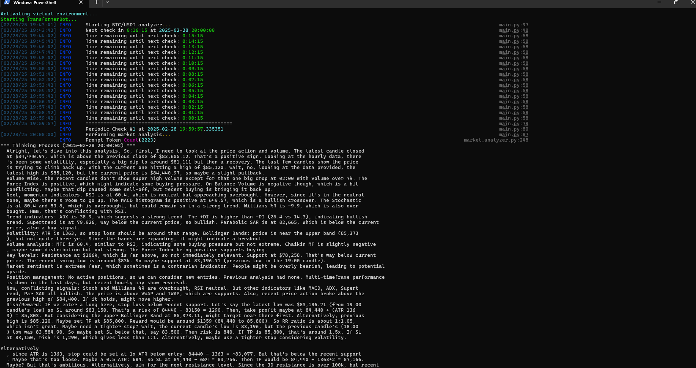
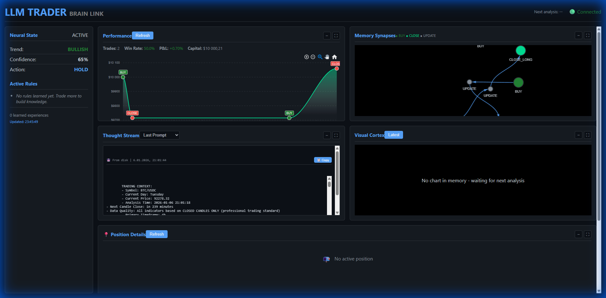
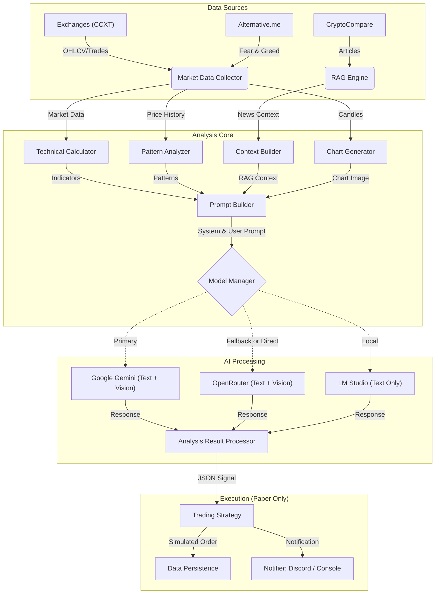

# 🤖 LLM_Trader v2

> **Status:** BETA / Paper Trading Only
>
> **Autonomous, asyncio-first trading bot that turns market + news + chart context into structured BUY/SELL/HOLD decisions.**

This is the **v2 evolution** of the original LLM_Trader project.
LLM_Trader v2 focuses on **continuous trading**, **risk-managed execution**, and **machine-readable (JSON) decisions** that can be reliably parsed and acted on.





## 🏗️ Architecture



## ✨ Verified Features

### 🧠 Vector-Only Trading Brain (Pure Vector Database)
- **ChromaDB Vector Store**: All trade statistics computed on-demand from rich metadata stored in the vector database—no JSON files needed.
- **Semantic Trade Retrieval**: Past trades are retrieved based on *semantic similarity* to current market conditions (Trend, ADX, Volatility, RSI, MACD, Volume, Bollinger Bands).
- **Adaptive Thresholds**: The system continuously learns optimal thresholds (ADX, R/R, confidence) from historical vector data without manual tuning.
- **Performance Bucketing**: Granular analysis of performance by ADX levels (LOW/MED/HIGH) and confluence factors (Trend Alignment, Momentum, Volume Support).
- **Real-Time Aggregation**: Statistics (confidence calibration, ADX performance, confluence factors) are computed directly from the vector store when needed, with smart caching.
- **Rich Per-Trade Metadata**: Each trade stores 15+ fields including RSI, ADX, ATR, SL/TP distances, R/R ratio, MAE/MFE, and confluence factor scores.
- **Context-Aware AI**: The AI sees: *"In similar conditions (High ADX + Bullish), we won 80% of trades with avg P&L +4.2%"* derived from semantic vector search.

### 🕐 Adaptive Memory System
- **Temporal Awareness**: Every trade stores `timestamp` and `market_regime` metadata, enabling time-windowed queries like "What worked in the last Bull Run?"
- **Decay Engine**: Recency-weighted retrieval using exponential decay (90-day half-life). Recent trades are prioritized over ancient history.
- **Hybrid Scoring**: Results ranked by `similarity * 0.7 + recency * 0.3` for optimal context relevance.
- **Automated Reflection Loop**: Every 10 trades, the brain synthesizes patterns from recent wins into persistent "Semantic Rules" (e.g., "LONG trades perform well in BULLISH market with High ADX").
- **Self-Learning Rules**: Semantic rules are stored persistently in a dedicated ChromaDB collection and injected into AI prompts.

### 🤖 AI & LLM Support
- **Multi-Provider Support**: 
  - **Google Gemini**: Configurable model selection. Optimized for `gemini-3-flash-preview` (Temp 1.0, TopK 64) via `config.ini`.
  - **Claude 4.5 / Google Gemini 3 Pro**: Support for state-of-the-art reasoning models via OpenRouter.
  - **LM Studio**: Local LLM support verified via `lm_studio_base_url`.
- **Fallback Logic**: Automatically switches providers if primary fails (Google AI -> OpenRouter -> Local).
- **Vision-Assisted Trading**: Generates technical charts with indicators and sends them to vision-capable models (e.g., Gemini Flash) for visual pattern confirmation.

### 📢 RAG Engine (News & Context)
- **News Aggregator**: Requires a **CryptoCompare API Key**. The free tier typically offers ~150k lifetime requests, which is sufficient for continuous bot operation.
- **Smart Relevance Scoring**: Uses **keyword density**, **category matching**, and **coin-specific heuristics** to filter noise and prioritize data-rich content.
- **Segmentation**: Uses `wtpsplit` for precise sentence segmentation to extract key facts/numbers.
- **Configurable Limits**: Adjustable token limits and article counts to manage context window.

### 🌍 Market Data & Exchanges
- **Multi-Exchange Aggregation**: Fetches data via `ccxt` from **5+ exchanges**:
  - Binance, KuCoin, Gate.io, MEXC, Hyperliquid
- **Comprehensive Data**:
  - OHLCV Candles (1m to 1w)
  - Order Book Depth & Spread Analysis
  - Recent Trade Flow (Buyer/Seller Pressure)
  - Funding Rates (for Perpetual Futures)

### 🔒 Application Safeguards
- **Cross-Platform Single-Instance Locking**: Prevents multiple instances from running concurrently, protecting against API rate limit bans and state corruption.
- **Graceful Shutdown Management**: Dedicated manager handles SIGINT (Ctrl+C) and SIGTERM, ensuring all trade data is persisted before exit.
- **Safety Confirmation**: Optional GUI confirmation (via PyQt6) or console prompts when attempting to shut down.

### 📈 Trading Intelligence
- **Realistic Capital Tracking**: Dynamic compounding of trading capital based on realized P&L. No static initial capital assumptions.
- **Advanced Performance Metrics**: Real-time calculation of **Sharpe Ratio**, **Sortino Ratio**, **Max Drawdown**, and **Profit Factor**.
- **Currency-Agnostic P&L**: Tracks profits and losses accurately in the relevant quote currency (e.g., USDT, ETH, BTC).
- **Vision-Assisted Trading**: Generates technical charts with indicators and sends them to vision-capable models (e.g., Gemini Flash) for visual pattern confirmation.

### 🖥️ Real-Time Web Dashboard
- **Brain Visualization**: Interactive network graph showing trade sequences (BUY → UPDATE → CLOSE) using Vis.js with physics-based layout and automatic stabilization.
- **Performance Chart**: Equity curve with zoom/pan controls, trade markers (BUY/CLOSE annotations), and ApexCharts integration.
- **Live Statistics**: Real-time stats display (Win Rate, P&L%, Capital, Trades) pulled from trading history.
- **Vector Memory Database**: Full ChromaDB visualization with experience table, confidence/ADX win rate breakdowns, and semantic similarity scores.
- **Thought Stream**: View last AI prompt and response with markdown rendering and copy-to-clipboard.
- **Visual Cortex**: Displays generated technical charts with lightbox for full-screen viewing.
- **Neural State Panel**: Shows current trend sentiment, confidence level, and recommended action.
- **Position Details**: Real-time position monitoring with entry price, duration, P&L gauges, and confluence factors.
- **Interactive Panel System**:
  - **Fullscreen Mode**: Expand any panel to fullscreen with proper chart/network resizing.
  - **Collapsible Panels**: Minimize panels to save screen space with responsive sibling expansion.
  - **WebSocket Real-Time Updates**: Live connection status indicator and auto-reconnection.


## 🗺️ Roadmap

- [x] **Local LLM Support** (LM Studio Integrated)
- [x] **Vision Analysis** (Chart Image Generation & Processing)
- [x] **RAG News Relevance Scoring**
- [x] **Vector Memory System** (ChromaDB + Semantic Search)
- [x] **Discord Integration** (Real-time signals, positions, and performance stats)
- [x] **Interactive CLI** (Hotkeys for manual control)
- [ ] **Multiple Trading Agent Personalities** (Diverse trading strategies: conservative, aggressive, contrarian, trend-following)
- [ ] **Multi-Model Consensus Decision-Making** (Aggregate predictions from multiple AI models to reach consensus on trading signals)
- [ ] **Live Trading** (Execution Layer)
- [x] **Web Dashboard** (FastAPI + Vis.js brain visualization)
- [ ] **Portfolio Management** (Multi-coin balancing)

## 🚀 Quick Start

### 1. Prerequisites
- Python 3.13+
- [LM Studio](https://lmstudio.ai/) (Optional, for local inference)

### 2. Installation

```powershell
# Clone repo
git clone https://github.com/qrak/LLM_trader.git
cd LLM_trader

# Setup Virtual Environment
python -m venv .venv
.venv\Scripts\Activate.ps1

# Install Dependencies
pip install -r requirements.txt
```

### 3. Configuration

1. **Credentials**: Copy `keys.env.example` to `keys.env`.
   ```ini
   OPENROUTER_API_KEY=your_key_here
   GOOGLE_STUDIO_API_KEY=your_key_here
   # Optional but Recommended Keys
   # -----------------------------
   # CRYPTOCOMPARE_API_KEY: Increases rate limits and reliability.
   # Free Tier available: https://min-api.cryptocompare.com/
   CRYPTOCOMPARE_API_KEY=your_key_here
   # COINGECKO_API_KEY: Increases rate limits (~30 req/min vs ~10 req/min public).
   # Free Demo API Key available (header: x-cg-demo-api-key)
   COINGECKO_API_KEY=your_key_here
   ```

2. **Bot Config**: Copy `config/config.ini.example` to `config/config.ini`. The default settings are "ready to go" for a standard setup, but you can edit it to customize your experience.
   ```ini
   [ai_providers]
   provider = googleai  # or "local", "openrouter", "all"
   lm_studio_base_url = http://localhost:1234/v1
   
   [general]
   crypto_pair = BTC/USDT
   timeframe = 1h
   ```

## 🎮 Usage

Run the bot:
```powershell
python start.py              # Default from config
python start.py ETH/USDT     # Specific pair
```

### ⌨️ Controls
| Key | Action |
| :--- | :--- |
| **`a`** | **Force Analysis**: Run immediate market check |
| **`h`** | **Help**: Show available commands |
| **`q`** | **Quit**: Gracefully shutdown the bot |


## 💬 Community & Support
- **Discord**: [Join our community](https://discord.gg/ZC48aTTqR2) for live signals, development chat, and support.
- **GitHub Issues**: Report bugs or suggest new features.

## ⚠️ Disclaimer
**EDUCATIONAL USE ONLY.** This software is currently in **BETA** and configured for **PAPER TRADING**. No real financial transactions are executed. The authors are not responsible for any financial decisions made based on this software.
