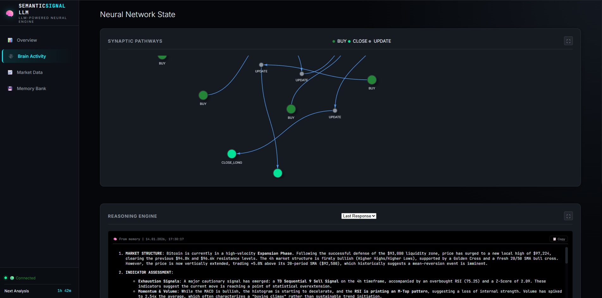
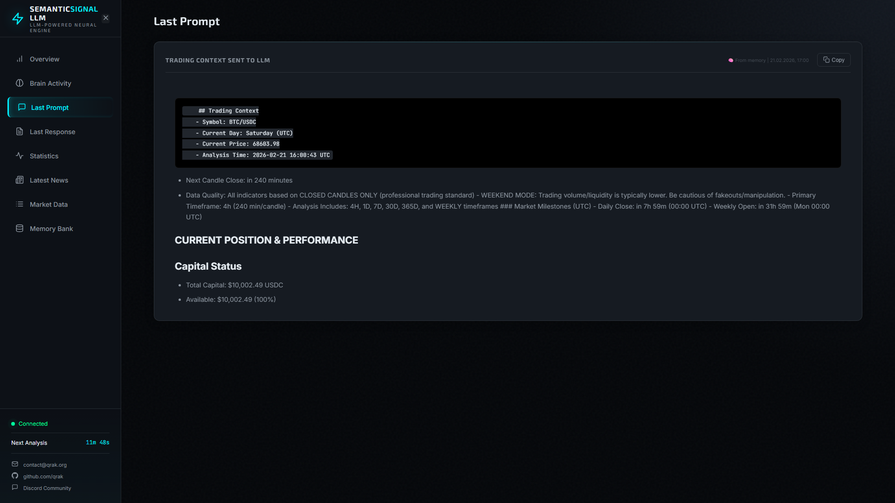
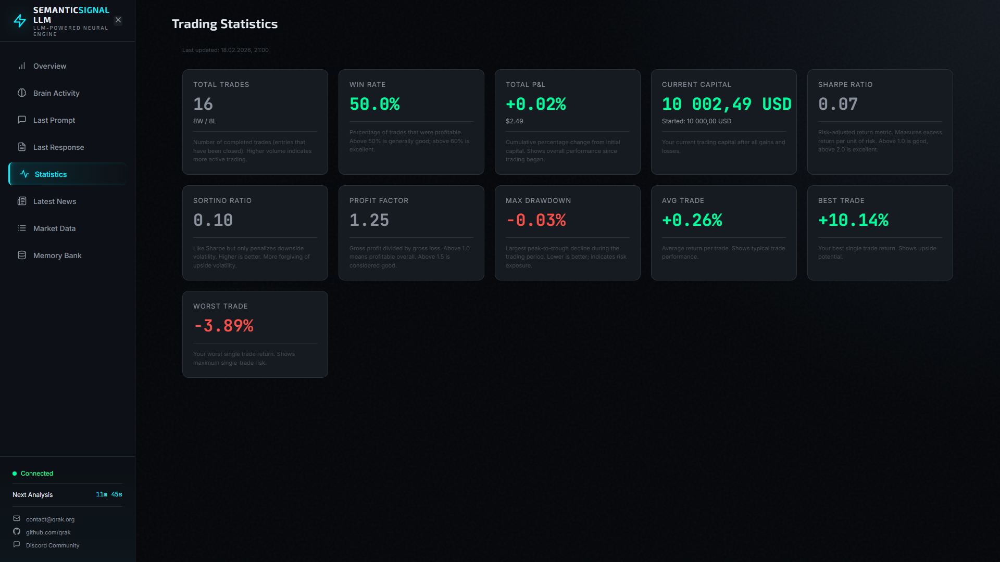
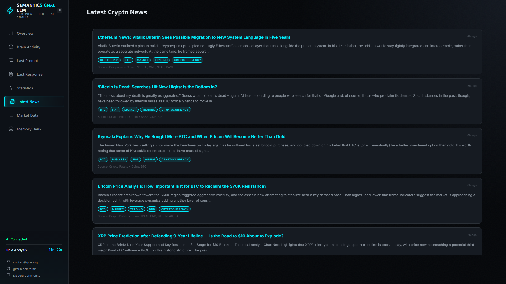
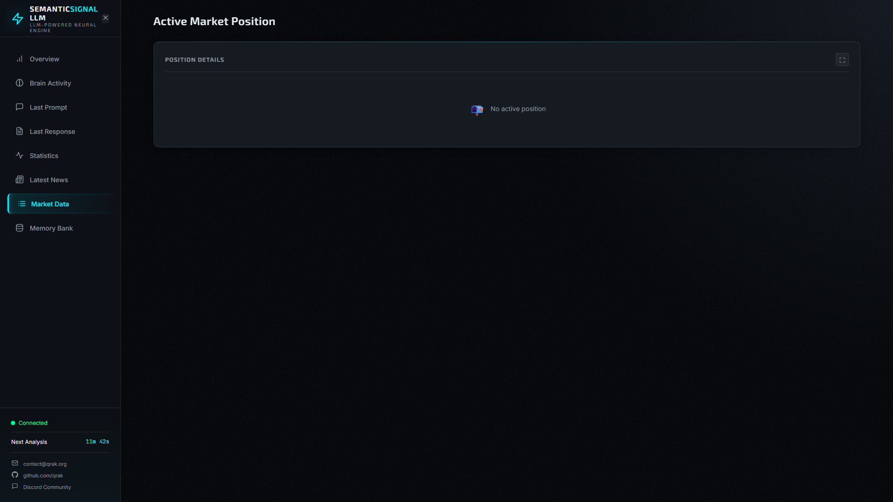
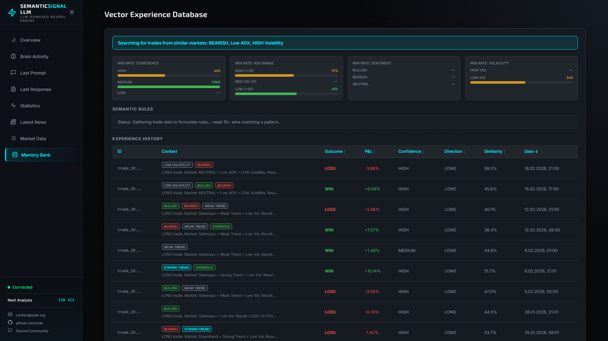
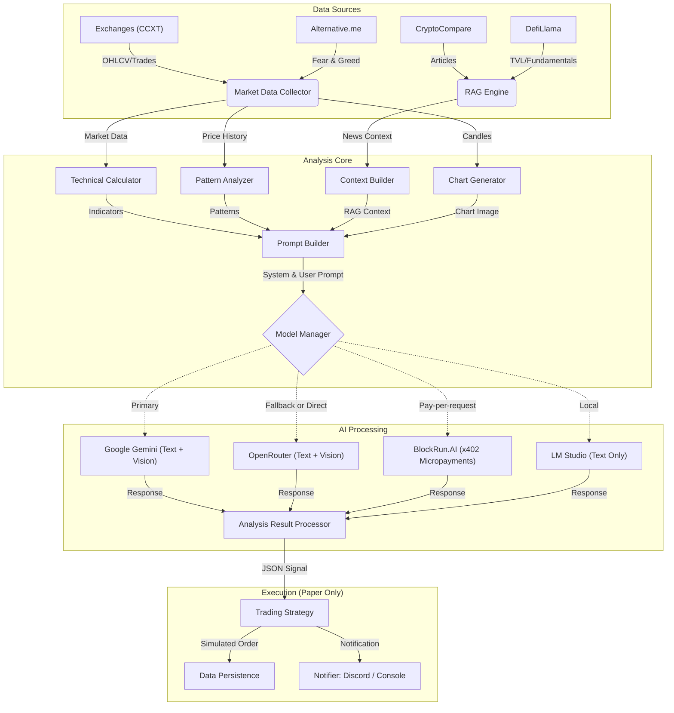

# 🤖 SEMANTIC SIGNAL LLM

> **Status:** BETA / Research Edition
>
> **Note:** This is the public research branch. It is frequently experimentally updated. The stable production version runs privately.
>
> **Autonomous, asyncio-first trading bot that turns market + news + chart context into structured BUY/SELL/HOLD decisions.**

🔗 **[Live Dashboard](https://semanticsignal.qrak.org)** — Real-time view of the neural trading brain










## 🏗️ Architecture



## ✨ Verified Features

### 🧠 Vector-Only Trading Brain (Pure Vector Database)
- **ChromaDB Vector Store**: All trade statistics computed on-demand from rich metadata stored in the vector database—no JSON files needed.
- **Semantic Trade Retrieval**: Past trades are retrieved based on *semantic similarity* to current market conditions (Trend, ADX, Volatility, RSI, MACD, Volume, Bollinger Bands, Weekend/Weekday, Fear & Greed Sentiment, Order Book Pressure).
- **Key Insights Flow**: Each trade stores the high-level reasoning generated by the AI at entry. When a trade closes, the system automatically retrieves the original entry reasoning to store it as a "Key Insight" in the vector memory, ensuring historical consistency even if intermediate updates occurred.
- **Adaptive Thresholds**: The system continuously learns optimal thresholds (ADX, R/R, confidence) from historical vector data without manual tuning.
- **Performance Bucketing**: Granular analysis of performance by ADX levels (LOW/MED/HIGH) and confluence factors (Trend Alignment, Momentum, Volume Support).
- **Real-Time Aggregation**: Statistics (confidence calibration, ADX performance, confluence factors) are computed directly from the vector store when needed, with smart caching.
- **Rich Per-Trade Metadata**: Each trade stores 15+ fields including RSI, ADX, ATR, SL/TP distances, R/R ratio, MAE/MFE, and confluence factor scores.
- **Context-Aware AI**: The AI sees: *"In similar conditions (High ADX + Bullish), we won 80% of trades with avg P&L +4.2%"* derived from semantic vector search.

### 🕐 Adaptive Memory System
- **Temporal Awareness**: Every trade stores `timestamp` and `market_regime` metadata, enabling time-windowed queries like "What worked in the last Bull Run?"
- **Decay Engine**: Recency-weighted retrieval using exponential decay (90-day half-life). Recent trades are prioritized over ancient history.
- **Hybrid Scoring**: Results ranked by `similarity * 0.7 + recency * 0.3` for optimal context relevance.
- **Automated Reflection Loop**: Every 10 trades, the brain automatically synthesizes patterns from recent wins/losses into persistent **Semantic Rules**.
  - **Positive Rules**: Generated when at least 5 wins follow a consistent regime/ADX pattern.
  - **Anti-Patterns**: Generated when at least 3 losses share a similar trait, flagging them as "⚠️ AVOID" patterns for future analysis.
- **Self-Learning Rules**: Semantic rules are stored persistently in a dedicated ChromaDB collection and injected into AI prompts to enforce learned behavior (e.g., "MANDATORY: If win rate <50%, reduce confidence").

### 🤖 AI & LLM Support
- **Multi-Provider Support**:
  - **Google Gemini**: Configurable model selection. Default: `gemini-3-flash-preview` (Temp 1.0, TopK 64, Thinking Level: high). Supports **Agentic Vision** (code execution for precise image analysis on Flash+).
  - **OpenRouter**: Access to frontier models. Default: `google/gemini-3-flash-preview` with `deepseek/deepseek-r1:free` as fallback.
  - **BlockRun.AI**: Pay-per-request access to 28+ AI models (ChatGPT, Claude, Gemini, etc.) via x402 micropayments on the Base blockchain. No subscriptions needed. Uses a dedicated local wallet for signing — funds never leave your machine.
  - **LM Studio**: Local LLM support via `lm_studio_base_url` for fully offline inference.
- **Fallback Logic**: Automatically switches providers if the primary fails: `Google AI → OpenRouter → BlockRun → Local`.
- **Vision-Assisted Trading**: Generates technical charts with indicators and sends them to vision-capable models (e.g., Gemini Flash) for visual pattern confirmation.

### 📢 RAG Engine (News & Context)
- **News Aggregator**: Requires a **CryptoCompare API Key**. The free tier typically offers ~150k lifetime requests, sufficient for continuous bot operation.
- **Smart Relevance Scoring**: Uses **keyword density**, **category matching**, and **coin-specific heuristics** to filter noise and prioritize data-rich content.
- **Lead Paragraph Extraction**: Extracts coherent lead paragraphs from articles following the "Inverted Pyramid" structure, preserving narrative flow and context.
- **DefiLlama Fundamentals**: Fetches TVL and on-chain fundamentals at a configurable interval (default: every 15 minutes) for DeFi context.
- **Configurable Limits**: Adjustable token limits, article counts, and news feed sources to manage context window and data quality.

### 🌍 Market Data & Exchanges
- **Multi-Exchange Aggregation**: Fetches data via `ccxt` from **5+ exchanges**:
  - Binance, KuCoin, Gate.io, MEXC, Hyperliquid
- **Comprehensive Data**:
  - OHLCV Candles (1m to 1w)
  - Order Book Depth & Spread Analysis
  - Recent Trade Flow (Buyer/Seller Pressure)
  - Funding Rates (for Perpetual Futures)

### 🔒 Application Safeguards
- **Cross-Platform Single-Instance Locking**: Prevents multiple instances from running concurrently, protecting against API rate limit bans and state corruption.
- **Graceful Shutdown Management**: Dedicated manager handles SIGINT (Ctrl+C) and SIGTERM, ensuring all trade data is persisted before exit.
- **Safety Confirmation**: Optional GUI confirmation (via PyQt6) or console prompts when attempting to shut down.

### 📈 Trading Intelligence
- **Realistic Capital Tracking**: Dynamic compounding of trading capital based on realized P&L. No static initial capital assumptions.
- **Advanced Performance Metrics**: Real-time calculation of **Sharpe Ratio**, **Sortino Ratio**, **Max Drawdown**, and **Profit Factor**.
- **Currency-Agnostic P&L**: Tracks profits and losses accurately in the relevant quote currency (e.g., USDC, ETH, BTC).
- **Vision-Assisted Trading**: Generates technical charts with indicators and sends them to vision-capable models (e.g., Gemini Flash) for visual pattern confirmation.
- **Weekend Awareness**: Automatic detection of weekend trading with explicit warnings about lower volume/liquidity and manipulation risks.

### 🖥️ Real-Time Web Dashboard
- **Brain Visualization**: Interactive network graph showing trade sequences (BUY → UPDATE → CLOSE) using Vis.js with physics-based layout and automatic stabilization.
- **Performance Chart**: Equity curve with zoom/pan controls, trade markers (BUY/CLOSE annotations), and ApexCharts integration.
- **Live Statistics**: Real-time stats display (Win Rate, P&L%, Capital, Trades) pulled from trading history.
- **Vector Memory Database**: Full ChromaDB visualization with **sortable columns** (Date, Similarity, P&L, Confidence, Outcome), experience table, and win rate breakdowns.
- **Thought Stream**: View last AI prompt and response with markdown rendering and copy-to-clipboard.
- **Visual Cortex**: Displays generated technical charts with lightbox for full-screen viewing.
- **Neural State Panel**: Shows current trend sentiment, confidence level, and recommended action.
- **Position Details**: Real-time position monitoring with entry price, duration, P&L gauges, and confluence factors.
- **Interactive Panel System**:
  - **Fullscreen Mode**: Expand any panel to fullscreen with proper chart/network resizing.
  - **Collapsible Panels**: Minimize panels to save screen space with responsive sibling expansion.
  - **WebSocket Real-Time Updates**: Live connection status indicator and auto-reconnection.

---

## 🗺️ Roadmap

- [x] **Local LLM Support** (LM Studio Integrated)
- [x] **Vision Analysis** (Chart Image Generation & Processing)
- [x] **RAG News Relevance Scoring**
- [x] **Vector Memory System** (ChromaDB + Semantic Search)
- [x] **Discord Integration** (Real-time signals, positions, and performance stats)
- [x] **Interactive CLI** (Hotkeys for manual control)
- [x] **Web Dashboard**: Real-time visualization of synaptic pathways and neural state.
- [x] **BlockRun.AI Integration**: Pay-per-request AI access via x402 micropayments.
- [x] **DefiLlama Fundamentals**: On-chain TVL context in the RAG pipeline.
- [ ] **Multiple Trading Agent Personalities**: Diverse strategist personalities (conservative, aggressive, contrarian, trend-following) that engage in cross-agent reasoning to refine market entry/exit precision.
- [ ] **Multi-Model Consensus Decision-Making**: A "Council of Models" architecture where specialized agents—**Visual Cortex Analyst** (chart vision), **Technical Specialist** (indicators), **Sentiment Scout** (news/macro), and **Memory Historian** (vector experiences)—collaborate to reach a final consensus signal.
- [ ] **Live Trading**: Execution Layer integration for verified order placement.
- [ ] **Concurrent Multi-Asset Analysis**: Scaling the engine to analyze 10+ coins simultaneously, leveraging parallel LLM execution for broad market coverage.

---

## 🚀 Quick Start

### 1. Prerequisites
- Python 3.13+
- [LM Studio](https://lmstudio.ai/) *(Optional — for local offline inference)*

### 2. Installation

```powershell
# Clone repo
git clone https://github.com/qrak/LLM_trader.git
cd LLM_trader

# Setup Virtual Environment
python -m venv .venv
.venv\Scripts\Activate.ps1

# Install Dependencies
pip install -r requirements.txt

# For development (linting, testing tools)
pip install -r requirements-dev.txt
```

### 3. Configuration

**Step 1 — API Keys**: Copy `keys.env.example` to `keys.env` and fill in your credentials.

```ini
# Required: At least one AI provider
OPENROUTER_API_KEY=your_key_here
GOOGLE_STUDIO_API_KEY=your_key_here          # Free tier
GOOGLE_STUDIO_PAID_API_KEY=your_key_here     # Paid tier (higher rate limits)

# Optional but Recommended
CRYPTOCOMPARE_API_KEY=your_key_here          # ~150k lifetime free requests
COINGECKO_API_KEY=your_key_here              # Free Demo key: ~30 req/min vs ~10 public

# BlockRun.AI (x402 micropayments — Base chain wallet private key)
# WARNING: Use a dedicated wallet with minimal funds only.
# BLOCKRUN_WALLET_KEY=0x0000...
```

**Step 2 — Bot Config**: Copy `config/config.ini.example` to `config/config.ini`. The defaults are ready to run, but key sections are explained below.

```ini
[ai_providers]
# Options: "local", "googleai", "openrouter", "blockrun", "all"
# "all" enables automatic fallback: Google → OpenRouter → BlockRun → Local
provider = googleai

google_studio_model = gemini-3-flash-preview
openrouter_base_model = google/gemini-3-flash-preview
openrouter_fallback_model = deepseek/deepseek-r1:free
blockrun_model = deepseek/deepseek-reasoner
lm_studio_base_url = http://localhost:1234/v1

[general]
crypto_pair = BTC/USDC
timeframe = 4h

[model_config]
# Critical for Gemini 3 Flash Preview
google_temperature = 1.0
google_thinking_level = high        # minimal | low | medium | high
google_code_execution = false       # Agentic Vision (Flash+ only, Google API only)

[dashboard]
host = 0.0.0.0   # Use 127.0.0.1 for local-only access
port = 8000
enable_cors = false

[demo_trading]
demo_quote_capital = 10000          # Simulated starting capital
transaction_fee_percent = 0.00075  # 0.075% limit order fee
```

> 💡 See `config/config.ini.example` for the full reference — it documents every setting including `[rag]`, `[exchanges]`, `[cooldowns]`, and `[debug]` sections.

---

## 🎮 Usage

```powershell
python start.py    # Reads all settings from config/config.ini
```

### ⌨️ Controls

| Key | Action |
| :--- | :--- |
| **`a`** | **Force Analysis**: Run immediate market check |
| **`h`** | **Help**: Show available commands |
| **`q`** | **Quit**: Gracefully shutdown the bot |

The dashboard will be available at `http://localhost:8000` (or the host/port configured in `config.ini`).

---

## 💬 Community & Support
- **Discord**: [Join our community](https://discord.gg/ZC48aTTqR2) for live signals, development chat, and support.
- **GitHub Issues**: Report bugs or suggest new features.

## ⚠️ Disclaimer
**EDUCATIONAL USE ONLY.** This software is currently in **BETA** and configured for **PAPER TRADING**. No real financial transactions are executed. The authors are not responsible for any financial decisions made based on this software.

## Contributors
- **Vicky (1bcMax)**: Implementation of BlockRun.AI provider and x402 payment integration.

## 📄 License
Licensed under the PolyForm Noncommercial License 1.0.0. See [LICENSE.md](LICENSE.md) for details.
