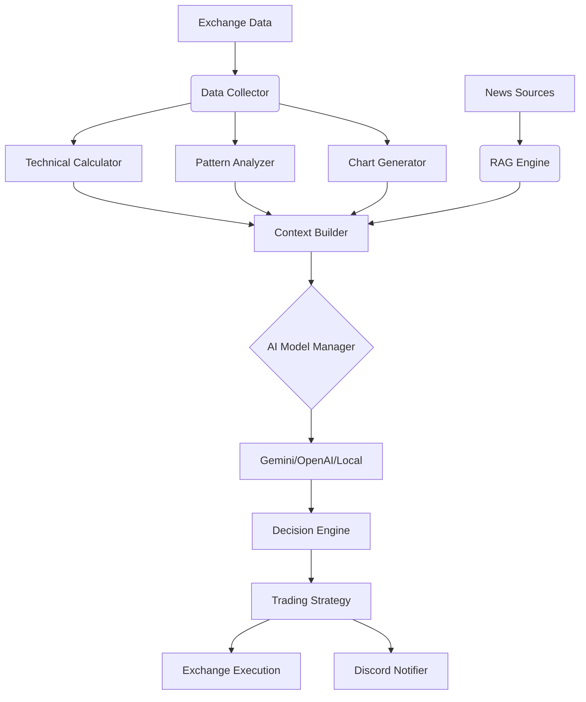

# 🤖 AI Crypto Trader

> **Autonomous AI-powered trading bot that analyzes patterns, news, and market structure to execute trades.**

This tool leverages advanced LLMs (Gemini, OpenRouter, LM Studio) to analyze cryptocurrency markets. It combines **Technical Analysis** (50+ indicators), **Chart Pattern Recognition**, and **RAG-based News Analysis** to make distinct trading decisions (Buy/Sell/Hold).

## ✨ Key Features

- **🧠 Adaptive Trading Brain**: Self-evolving knowledge system that learns from confluence factors and applies statistical significance to trading insights.
- **📢 RAG Engine V2**: Advanced news analysis with `wtpsplit` segmentation and multi-factor relevance scoring.
- **👀 AI Vision Analysis**: Generates and feeds chart images to Vision models for visual pattern confirmation.
- **⌨️ Interactive Console**: Real-time control (Force Analysis `a`, Help `h`, Quit `q`).
- **🛡️ Risk Management**: Built-in support for customized Stop Loss, Take Profit, and Position Sizing.
- **📡 Multi-Exchange**: Support for Binance, KuCoin, Gate.io, and others via `ccxt`.

## 🏗️ System Architecture



## � Quick Start

### 1. Prerequisites
- Python 3.11+

### 2. Installation

```powershell
# Clone repo
git clone https://github.com/yourusername/LLM_trader.git
cd LLM_trader

# Setup Virtual Environment
python -m venv .venv
.venv\Scripts\Activate.ps1

# Install Dependencies
pip install -r requirements.txt
```

### 3. Configuration

1. **Credentials**: Copy `keys.env.example` to `keys.env` and fill in your keys.
   ```ini
   # keys.env
   GOOGLE_API_KEY=...
   OPENROUTER_API_KEY=...
   DISCORD_BOT_TOKEN=...
   DISCORD_CHANNEL_ID=...
   ```

2. **Bot Config**: Edit `config/config.ini` to set timeframe, AI provider, and risk parameters.

## 🎮 Usage

Run the bot for a specific pair:

```powershell
python start.py BTC/USDT    # Default timeframe (4h)
python start.py ETH/USDT 1h # Custom timeframe
```

### ⌨️ Keyboard Shortcuts
| Key | Action |
| :--- | :--- |
| **`a`** | **Force Analysis**: Run immediate market check |
| **`h`** | **Help**: Show available commands |
| **`q`** | **Quit**: Gracefully shutdown the bot |

## 📊 Example Console Output

```log
================================================================================
ANALYSIS RESULTS FOR BTC/USDT (4h)
================================================================================
AI THINKING:
"RSI is 67.3 (Bullish). MACD crossed upward. Chart shows Cup & Handle formation.
News sentiment is positive (ETF inflows). I recommend a LONG position."

TRADING DECISION:
Action: BUY
Confidence: HIGH (85%)
Entry: $92,450
Stop Loss: $90,500
Take Profit: $98,000
Reasoning: Strong momentum + structural breakout confirmed by Vision model.
================================================================================
```

## 🛠️ Project Structure

- `src/analyzer/`: Core logic for data collection and prompt engineering.
- `src/trading/`: Position management and execution strategy.
- `src/platforms/`: Integrations (Exchanges, AI Providers).
- `src/rag/`: News fetching and vector store context.
- `src/discord_interface/`: Remote monitoring and alerts.

## 🤝 Contributing
Contributions are welcome! See [CONTRIBUTING.md](CONTRIBUTING.md).

## ⚠️ Disclaimer
**USE AT YOUR OWN RISK.** This software is for educational purposes. Cryptocurrency trading involves significant risk of financial loss. The authors are not responsible for any financial damages.
