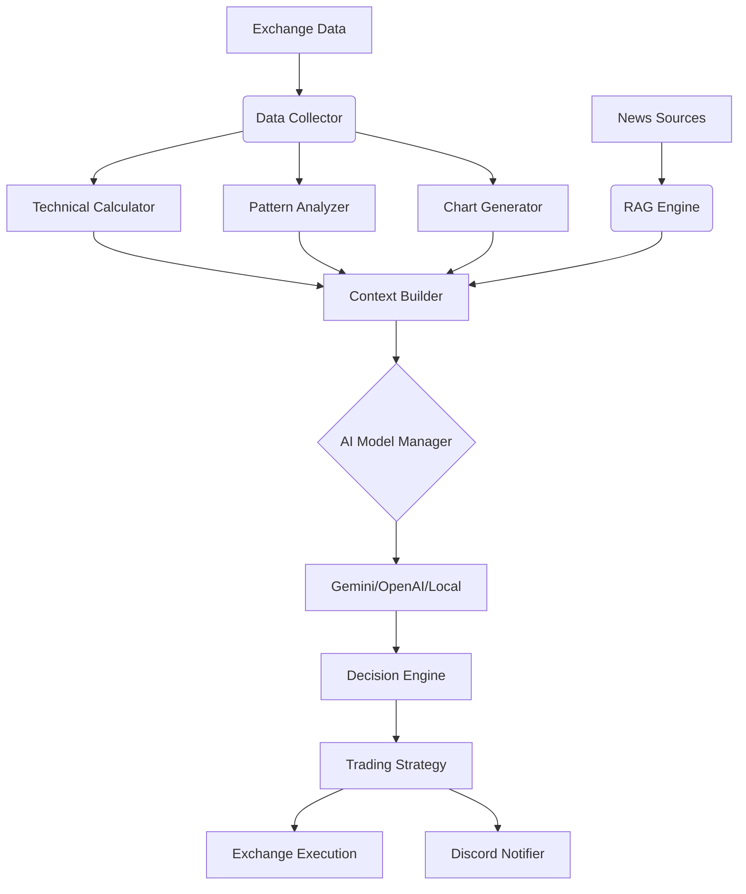

# 🤖 LLM_Trader v2 — AI Crypto Trading Bot

> **Autonomous, asyncio-first trading bot that turns market + news + chart context into structured BUY/SELL/HOLD decisions.**

This is the **v2 evolution** of the original LLM_Trader project (v1/legacy: https://github.com/qrak/LLM_trader).
LLM_Trader v2 focuses on **continuous trading**, **risk-managed execution**, and **machine-readable (JSON) decisions** that can be reliably parsed and acted on.

## ✨ What’s New in v2 (vs v1)

- **🧠 Trading Brain (self-learning)**: Builds *distilled* insights from closed trades (not raw logs), tracks confidence calibration + factor performance, and injects validated lessons back into prompts.
- **📢 RAG Engine v2 for news**: `wtpsplit` segmentation + relevance scoring to feed only the most useful news context.
- **👀 Vision-assisted charts**: Generates chart images and can send them to vision-capable models for pattern confirmation.
- **🔁 Continuous trading loop**: Periodic checks per timeframe candle with position monitoring and automated SL/TP handling.
- **🧾 JSON-first outputs**: Prompts are designed to produce structured trading signals (no long-form analysis required).
- **📡 Multi-exchange support**: `ccxt` integrations (Binance, KuCoin, Gate.io, and more).

## ✨ Key Features

- **Technical analysis at scale**: 50+ indicators across trend/momentum/volatility/volume.
- **Pattern recognition + market structure**: Pattern analyzer and contextual market metrics.
- **Risk management**: Stop-loss / take-profit / position sizing hooks baked into the trading flow.
- **Interactive console controls**: Force analysis (`a`), help (`h`), quit (`q`).
- **Optional notifications**: Discord notifier support for remote monitoring.

## 🏗️ System Architecture



## 🚀 Quick Start

### 1. Prerequisites
- Python 3.11+

### 2. Installation

```powershell
# Clone repo
git clone https://github.com/qrak/LLM_trader.git
cd LLM_trader

# Setup Virtual Environment
python -m venv .venv
.venv\Scripts\Activate.ps1

# Install Dependencies
pip install -r requirements.txt
```

### 3. Configuration

1. **Credentials**: Copy `keys.env.example` to `keys.env` and fill in your keys.
   ```ini
   # keys.env
   GOOGLE_API_KEY=...
   OPENROUTER_API_KEY=...
   DISCORD_BOT_TOKEN=...
   DISCORD_CHANNEL_ID=...
   ```

2. **Bot Config**: Edit `config/config.ini` to set timeframe, AI provider, and risk parameters.

## 🎮 Usage

Run the bot for a specific pair:

```powershell
python start.py              # Default: BTC/USDT (per config)
python start.py ETH/USDT     # Trade a specific symbol
python start.py BTC/USDT -t 4h
python start.py SOL/USDT -t 1h
```

### ⌨️ Keyboard Shortcuts
| Key | Action |
| :--- | :--- |
| **`a`** | **Force Analysis**: Run immediate market check |
| **`h`** | **Help**: Show available commands |
| **`q`** | **Quit**: Gracefully shutdown the bot |

## 📊 Example Console Output

```json
{
    "analysis": {
        "signal": "BUY",
        "confidence": 85,
        "confluence_factors": {
            "trend_alignment": 78,
            "momentum_strength": 82,
            "volume_support": 74,
            "pattern_quality": 80,
            "support_resistance_strength": 69
        },
        "entry_price": 92450,
        "stop_loss": 90500,
        "take_profit": 98000,
        "position_size": 0.25,
        "reasoning": "Strong momentum + structural breakout; clear invalidation below support."
    }
}
```

Note: The bot extracts the trading decision from the fenced JSON block above. Extra text outside the JSON may be present (model-dependent) but is treated as non-authoritative.

## 🛠️ Project Structure

- `src/analyzer/`: Core logic for data collection and prompt engineering.
- `src/trading/`: Position management and execution strategy.
- `src/platforms/`: Integrations (Exchanges, AI Providers).
- `src/rag/`: News fetching and vector store context.
- `src/discord_interface/`: Remote monitoring and alerts.

## 🧪 Testing

```powershell
pytest
```

## 🤝 Contributing
Contributions are welcome! See [CONTRIBUTING.md](CONTRIBUTING.md).

## ⚠️ Disclaimer
**USE AT YOUR OWN RISK.** This software is for educational purposes. Cryptocurrency trading involves significant risk of financial loss. The authors are not responsible for any financial damages.
