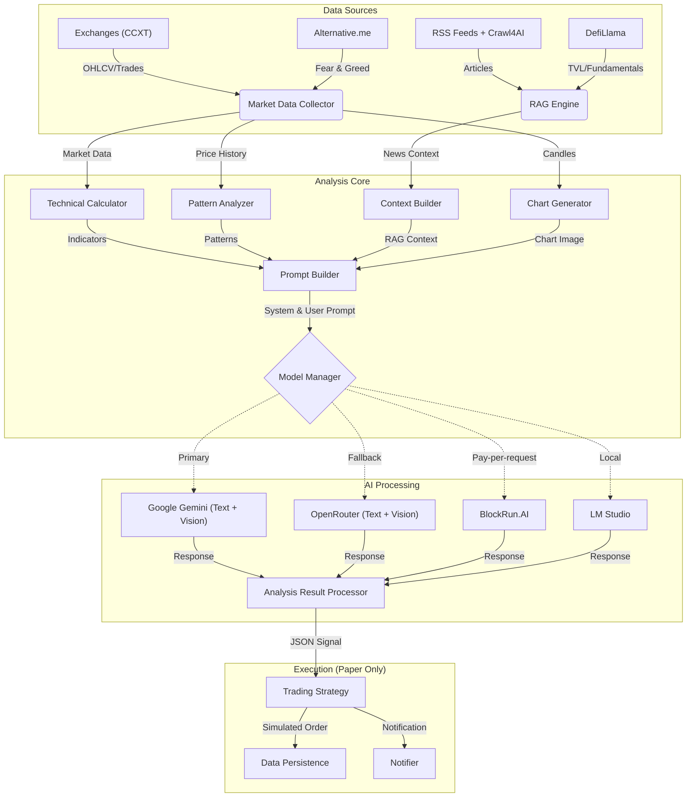

# 🤖 SEMANTIC SIGNAL LLM (LLM Trader)

> **Status:** BETA / Research Edition
>
> **Note:** This is the public research branch. It is frequently experimentally updated. The stable production version runs privately.
>
> **News Pipeline Update (2026):** CryptoCompare free News API tier is being retired. News ingestion now uses free RSS sources with Crawl4AI-based page enrichment.
>
> **Autonomous, asyncio-first trading bot that turns market + news + chart context into structured BUY/SELL/HOLD decisions.**

🔗 **[Live Dashboard](https://semanticsignal.qrak.org)** — Real-time view of the neural trading brain

## Key Features

- **Vector-Only Trading Brain**: ChromaDB vector store for semantic trade retrieval and adaptive thresholds.
- **Adaptive Memory System**: Temporal awareness, decay engine, and automated reflection loops generating persistent Semantic Rules.
- **RAG Engine**: Aggregates news from free RSS feeds with optional Crawl4AI enrichment, plus fundamentals from DefiLlama.
- **AI & LLM Support**: Multi-provider support (Google Gemini, OpenRouter, BlockRun.AI, LM Studio) with fallback logic and vision-assisted trading.
- **Multi-Exchange Aggregation**: Fetches data via `ccxt` from Binance, KuCoin, Gate.io, MEXC, Hyperliquid.


## Tech Stack

- **Language**: Python 3.13+
- **Database (Vector)**: ChromaDB
- **Dashboard Backend**: FastAPI, WebSockets
- **Dashboard Frontend**: HTML, Vanilla JS, Vis.js, ApexCharts
- **AI Integrations**: Google Gemini, OpenRouter, BlockRun.AI, LM Studio
- **Market Data**: CCXT, [CoinGecko](https://www.coingecko.com), Alternative.me, DefiLlama
- **Code Quality**: Ruff, Pylint, Mypy

## Prerequisites

- Python 3.13+
- [LM Studio](https://lmstudio.ai/) (Optional — for local offline inference)

## Getting Started

### 1. Clone the Repository

```bash
git clone https://github.com/qrak/LLM_trader.git
cd LLM_trader
```

### 2. Setup Virtual Environment

```powershell
# Setup Virtual Environment
python -m venv .venv
.venv\Scripts\Activate.ps1
```

### 3. Install Dependencies

```powershell
# Install required dependencies
pip install -r requirements.txt

# Optional but recommended for browser-grade news extraction
crawl4ai-setup

# For development (linting, testing tools)
pip install -r requirements-dev.txt
```

### 4. Environment Setup

Copy the example keys file:

```powershell
cp keys.env.example keys.env
```

Configure the following variables in `keys.env`:

| Variable | Description |
| --- | --- |
| `OPENROUTER_API_KEY` | (Required) OpenRouter API key if used as a provider. |
| `GOOGLE_STUDIO_API_KEY` | (Required) Google AI Studio API key (free tier). |
| `GOOGLE_STUDIO_PAID_API_KEY` | (Optional) Google AI Studio API key (paid tier). |
| `COINGECKO_API_KEY` | (Optional) Free demo key for market metrics. |
| `BLOCKRUN_WALLET_KEY` | (Optional) Private key for BlockRun.AI x402 micropayments. |

### 5. Bot Configuration

Copy the example config file:

```powershell
cp config/config.ini.example config/config.ini
```

Key sections to configure:

```ini
[ai_providers]
# Options: "local", "googleai", "openrouter", "blockrun", "all"
provider = googleai
google_studio_model = gemini-3-flash-preview
openrouter_base_model = google/gemini-3-flash-preview

[general]
crypto_pair = BTC/USDC
timeframe = 4h

[model_config]
google_temperature = 1.0
google_thinking_level = high

[dashboard]
host = 0.0.0.0
port = 8000

[demo_trading]
demo_quote_capital = 10000
transaction_fee_percent = 0.00075

[risk_management]
# soft = candle-close checks, hard = bot-side interval checks on live ticker
stop_loss_type = soft
stop_loss_check_interval = 1h
take_profit_type = soft
take_profit_check_interval = 1h

[rag]
# Whitelist filter — only these source keys are enabled. Leave empty to enable all configured news_source_*_url entries.
news_sources = coindesk,cointelegraph,decrypt

# Use Crawl4AI for page enrichment
news_crawl4ai_enabled = true
```

Both exit check intervals must be less than or equal to `[general] timeframe`. Soft exits are evaluated only at candle close; hard exits are bot-side checks against live ticker price at the configured interval.

### 6. Start the Bot

Run the bot directly via Python:

```powershell
python start.py
```

The dashboard will be available at `http://localhost:8000`.

Cloudflare setup reference: `docs/cloudflare_free_cache_playbook.md`.

### 7. Controls

| Key | Action |
| --- | --- |
| **`a`** | **Force Analysis**: Run immediate market check |
| **`d`** | **Toggle Dashboard**: Enable or disable the dashboard while the program is running |
| **`h`** | **Help**: Show available commands |
| **`q`** | **Quit**: Gracefully shutdown the bot |

## Architecture

At its core, the Crypto Trading Bot leverages LLMs along with a Retrieval-Augmented Generation (RAG) engine to ingest market news, evaluate technical indicators, pattern recognition, and internal trading history ("brain memory"). By combining statistical indicators with human-like textual evaluation, it formulates `BUY`, `SELL`, `HOLD`, or `CLOSE` decisions.


```mermaid
graph TD
    subgraph Data Sources
        Ex["Exchanges (CCXT)"] --> |OHLCV/Trades| DC(Market Data Collector)
        News[RSS Feeds + Crawl4AI] --> |Articles| RAG(RAG Engine)
        Sent[Alternative.me] --> |Fear & Greed| DC
        DeFi[DefiLlama] --> |TVL/Fundamentals| RAG
    end

    subgraph Analysis Core
        DC --> |Market Data| TC[Technical Calculator]
        DC --> |Price History| PA[Pattern Analyzer]
        DC --> |Candles| CG[Chart Generator]
        
        RAG --> |News Context| CB[Context Builder]
        
        %% Orchestration / Assembly
        TC --> |Indicators| PB[Prompt Builder]
        PA --> |Patterns| PB
        CB --> |RAG Context| PB
        CG --> |Chart Image| PB
        
        PB --> |System & User Prompt| MM{Model Manager}
    end

    subgraph AI Processing
        %% Provider Selection Logic (Sequential / Fallback)
        MM -.-> |Primary| Google["Google Gemini (Text + Vision)"]
        MM -.-> |Fallback| OR["OpenRouter (Text + Vision)"]
        MM -.-> |Pay-per-request| BR["BlockRun.AI"]
        MM -.-> |Local| Local["LM Studio"]
        
        Google --> |Response| ARP[Analysis Result Processor]
        OR --> |Response| ARP
        BR --> |Response| ARP
        Local --> |Response| ARP
    end

    subgraph Execution ["Execution (Paper Only)"]
        ARP --> |JSON Signal| TS[Trading Strategy]
        TS --> |Simulated Order| DP[Data Persistence]
        TS --> |Notification| DN["Notifier"]
    end
```

### Application Entry Points

- `start.py`
  - The true entry point implementing the **Composition Root** and Dependency Injection (DI) pattern.
  - Bootstraps API clients, memory layers, LLM managers, and the RAG engine concurrently.
  - Instantiates the `DashboardServer`.
- `src/app.py`
  - Contains the `CryptoTradingBot` class. Manages the continuous polling rhythm, trading lifecycle, and real-time Discord alerts.

### Directory Structure & Subsystems

```text
src/
├── analyzer/          # Turns mathematical bounds into descriptive semantic markers
│   ├── pattern_engine/# Validates topological shapes & regressions (Head & Shoulders, Trenlines)
│   ├── formatters/    # Converts array flows and objects into markdown strings
│   └── prompts/       # Dynamic composition of system/user blocks for LLM contexts
├── rag/               # Retrieval-Augmented Knowledge Engine
├── trading/           # State, positions, risk metrics & biological "Brain" tracking  
├── managers/          # Shared state persistence and AI model routing
├── platforms/         # External REST/GraphQL integrations (CCXT, Gemini, OpenRouter)
├── dashboard/         # Real-time Web UI telemetry (FastAPI, WebSockets)
├── indicators/        # Massive suite of NumPy/Numba powered array calculation files
├── parsing/           # Resilient LLM JSON output bounds checking
├── notifiers/         # Markdown-styled embedded notifications for Discord/Console
└── factories/         # Safe DI dependency construction masking internal logic
tests/                 # Extensive unit and integration validations with API knocking
docs/                  # Deep technical documentation and component plans
```

### Request Lifecycle

1. **Pulse Checks**: Every configurable candle/loop wait, `app.py` triggers a market check.
2. **Data & Vectors**: `rag_engine` pulls recent crypto news directly related to chosen Ticker. Concurrently, `analysis_engine` uses `technical_calculator` on exact timestamp OHLCV.
3. **Retrieval**: `trading_strategy` and `brain.py` fetch the top comparable historical situations based on technical attributes + PnL success vs failure from ChromaDB. 
4. **LLM Formulation**: A highly formatted markdown prompt is handed through `model_manager` requesting `BUY`, `SELL`, or `HOLD` along with risk management targets.
5. **Execution**: Result triggers a change directly translated to trade sizes sent towards the connected `ExchangeManager` and recorded by `statistics.py`. Outputs are streamed via WebSockets toward the `dashboard`.

## Testing

The codebase contains a rigorous `tests/` directory covering integration logic, mocking, and unit testing validation. This minimizes regressions specifically in LLM parsing behavior.

```powershell
# Run the test suite using pytest (make sure pytest is installed)
pytest tests/
```

## Roadmap

- [x] **Local LLM Support** (LM Studio Integrated)
- [x] **Vision Analysis** (Chart Image Generation & Processing)
- [x] **RAG News Relevance Scoring**
- [x] **Vector Memory System** (ChromaDB + Semantic Search)
- [x] **Discord Integration** (Real-time signals, positions, and performance stats)
- [x] **Interactive CLI** (Hotkeys for manual control)
- [x] **Web Dashboard**: Real-time visualization of synaptic pathways and neural state.
- [x] **BlockRun.AI Integration**: Pay-per-request AI access via x402 micropayments.
- [x] **DefiLlama Fundamentals**: On-chain TVL context in the RAG pipeline.
- [ ] **Multiple Trading Agent Personalities**: Diverse strategist personalities (conservative, aggressive, contrarian, trend-following).
- [ ] **Multi-Model Consensus Decision-Making**: A "Council of Models" architecture.
- [ ] **Live Trading**: Execution Layer integration for verified order placement.
- [ ] **Static Documentation Site**: Transition docs into a browsable static site (e.g. `MkDocs` or `VitePress`).

## Community & Support
- **Discord**: [Join our community](https://discord.gg/ZC48aTTqR2) for live signals, development chat, and support.
- **GitHub Issues**: Report bugs or suggest new features.

## Disclaimer
**EDUCATIONAL USE ONLY.** This software is currently in **BETA** and configured for **PAPER TRADING**. No real financial transactions are executed. The authors are not responsible for any financial decisions made based on this software.

## Contributors
- **Vicky (1bcMax)**: Implementation of BlockRun.AI provider and x402 payment integration.

## License
Licensed under the [MIT License](LICENSE.md).
