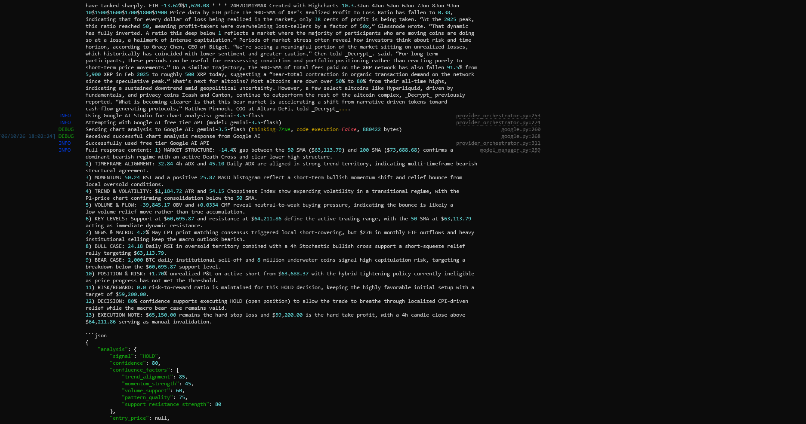
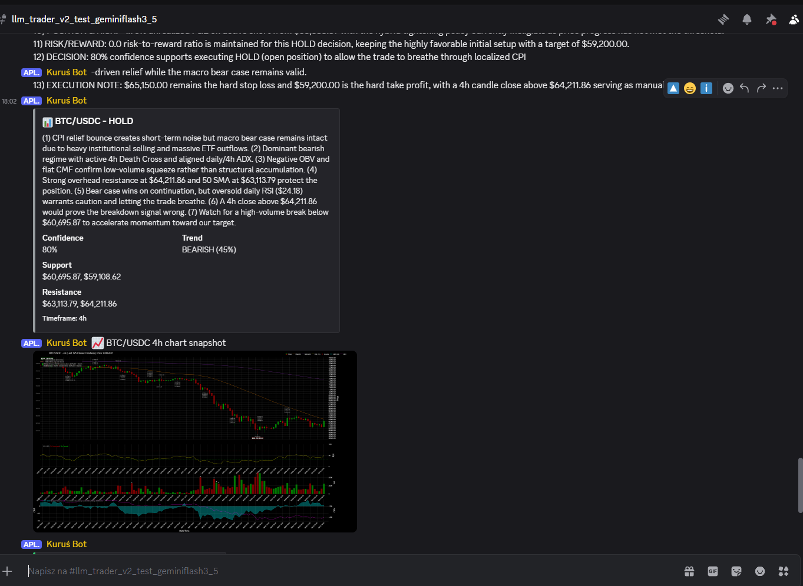
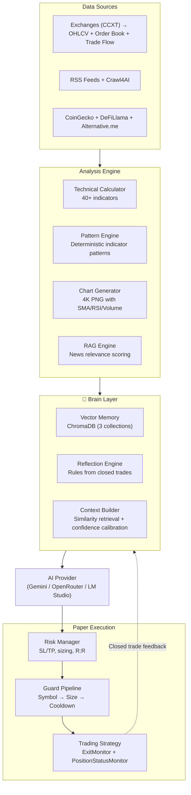

# 🤖 SEMANTIC SIGNAL LLM (LLM Trader)

*An autonomous AI trading agent that reads charts, remembers outcomes, and sharpens its strategy in real time.*

[](https://www.python.org)
[](LICENSE.md)
[](https://github.com/qrak/LLM_trader)

📊 **[Live Dashboard](https://semanticsignal.qrak.org)** — Watch the neural trading brain in action  
📖 **[Read the Full Story (Medium)](https://medium.com/@donqrakko/i-built-a-trading-bot-that-doesnt-just-calculate-it-reasons-remembers-and-learns-from-its-749064869d73)**  
💬 **[Join the Discord](https://discord.gg/ZC48aTTqR2)**  

---

> 💡 **Paper trading by default.** A real exchange execution service ([llm_trader_executor](https://github.com/qrak/llm_trader_executor)) is currently in testing — it consumes this bot's decisions and places live CCXT orders. Coming soon. Stay tuned.

---

## Quick Start

```bash
git clone https://github.com/qrak/LLM_trader.git && cd LLM_trader
python -m venv .venv && source .venv/bin/activate  # or .venv\Scripts\Activate.ps1 on Windows
pip install -r requirements.txt
cp keys.env.example keys.env  # add your API keys (Google Gemini free tier works)
python start.py               # dashboard at http://localhost:8000
```

<details>
<summary>Detailed setup for Windows, Linux, macOS →</summary>

**Platform-specific scripts** live in `scripts/` — they handle venv creation, dependency install, and startup:

| Script | Purpose |
|--------|---------|
| `scripts/start_script_main.ps1` | Start the bot (Windows) |
| `scripts/start_script_main_linux.sh` | Start the bot (Linux) |
| `scripts/start_script_main_macos.sh` | Start the bot (macOS) |
| `scripts/run_all_tests.sh` | Run full test suite in `.venv` |
| `scripts/query_trade_history.py` | CLI utility to inspect SQLite trade history |
</details>

### Runtime Controls

| Key | Action |
|-----|--------|
| `a` | Force analysis — run immediate market check |
| `d` | Toggle dashboard on/off |
| `h` | Help — show available commands |
| `q` | Quit — graceful shutdown with state preservation |

---

## 📸 Screenshots





---

## Features

- **🧠 Brain with Memory** — ChromaDB vector store retains trade experiences, semantic rules, and system rejections. Past outcomes are retrieved by similarity to current market conditions and injected into every LLM prompt.
- **📈 Vision AI Chart Analysis** — Generates 4K PNG candlestick charts with indicators, sends them to a multimodal LLM (Gemini 3.5 Flash) for visual pattern recognition. Chart-pattern code was dropped because the AI reads charts better than hardcoded rules.
- **🔄 Reflection Engine** — After every `N` closed trades, the system synthesizes best-practice rules, anti-patterns, and AI-mistake rules. These persist in vector memory and influence future decisions — the bot learns from its own outcomes.
- **✅ Claim Validation** — Every LLM response is cross-checked against computed indicators. Reported trend strength is compared against actual ADX; pattern quality is replaced by a deterministic scorer. No blind trust in AI numeric claims.
- **📰 RAG News Engine** — Aggregates crypto news from free RSS feeds (CoinDesk, CoinTelegraph, Decrypt, CryptoSlate) with optional Crawl4AI enrichment, plus fundamentals from DeFiLlama.
- **📊 Live Dashboard** — FastAPI + WebSocket real-time UI at `0.0.0.0:8000` (or [semanticsignal.qrak.org](https://semanticsignal.qrak.org)). Shows brain activity, last prompt/response, position state, performance stats, news, market data, and memory bank.
- **🛡️ Risk Pipeline** — Pre-execution guard chain (symbol whitelist, max position size, cooldown) + dynamic SL/TP scaling with minimum 1.5 R:R enforced. Soft exits at candle close, hard exits at configurable intervals against live ticker price.
- **🔄 Multi-Provider AI Routing** — Primary: Google Gemini 3.5 Flash (free tier). Fallback chain through OpenRouter and LM Studio. Chart vision support on every provider that allows it.
- **🧪 900+ Tests** — Fully mocked test suite covering LLM output corruption, async races, rate-limit backoff, vector-DB boundaries, friction-reporting, and closed-loop feedback.

---

## Architecture



```mermaid
flowchart TB
    subgraph Data["Data Sources"]
        EX["Exchanges (CCXT) → OHLCV + Order Book + Trade Flow"]
        NEWS["RSS Feeds + Crawl4AI"]
        FUND["CoinGecko + DeFiLlama + Alternative.me"]
    end
    subgraph Analysis["Analysis Engine"]
        TC["Technical Calculator<br/>40+ indicators"]
        PE["Pattern Engine<br/>Deterministic indicator patterns"]
        CG["Chart Generator<br/>4K PNG with SMA/RSI/Volume"]
        RAG["RAG Engine<br/>News relevance scoring"]
    end
    subgraph Brain["🧠 Brain Layer"]
        VM["Vector Memory<br/>ChromaDB (3 collections)"]
        REFL["Reflection Engine<br/>Rules from closed trades"]
        CTX["Context Builder<br/>Similarity retrieval + confidence calibration"]
    end
    subgraph Execution["Paper Execution"]
        RP["Risk Manager<br/>SL/TP, sizing, R:R"]
        GP["Guard Pipeline<br/>Symbol → Size → Cooldown"]
        STRAT["Trading Strategy<br/>ExitMonitor + PositionStatusMonitor"]
    end
    Data --> Analysis
    Analysis --> Brain
    Brain --> AI["AI Provider<br/>(Gemini / OpenRouter / LM Studio)"]
    AI --> RP --> GP --> STRAT
    STRAT -.->|Closed trade feedback| Brain
```

### Key Files

| Path | Role |
|------|------|
| `start.py` | Entry point — 8-stage dependency injection, ChromaDB + CoinGecko cache setup |
| `src/app.py` | `CryptoTradingBot` — main async loop, ticker fetch, analysis orchestration |
| `src/trading/brain.py` | `TradingBrainService` — context assembly, experience recording, reflection triggers |
| `src/trading/vector_memory.py` | ChromaDB interface — trade experiences, semantic rules, blocked trades |
| `src/analyzer/analysis_engine.py` | Market analysis orchestration — indicators, chart, RAG, LLM call |
| `src/managers/provider_orchestrator.py` | AI provider fallback chain with retry logic |
| `src/managers/risk_manager.py` | Dynamic SL/TP, position sizing, friction tracking |
| `src/trading/trading_strategy.py` | Position lifecycle, guard enforcement, exit monitoring |
| `src/analyzer/prompts/template_manager.py` | System prompt construction with falsification-based invalidation step |
| `src/analyzer/trend_validator.py` | Cross-checks LLM-reported trend strength against computed ADX |
| `src/analyzer/pattern_quality_scorer.py` | Deterministic pattern quality scoring replacing LLM's self-reported score |
| `src/notifiers/notifier.py` | Discord notifications with message expiration tracking |

---

## Testing

```bash
# Full suite (900+ tests)
pytest tests/ -q

# Focused
pytest tests/test_ticker_retry.py tests/test_brain_integration.py -q

# Linting
ruff check src tests start.py
```

---

## Configuration

Key settings in `config/config.ini`:

| Setting | Default | Description |
|---------|---------|-------------|
| `crypto_pair` | BTC/USDC | Trading pair |
| `timeframe` | 4h | Analysis candle timeframe |
| `provider` | googleai | AI provider (googleai, openrouter, lmstudio) |
| `demo_quote_capital` | 10000 | Simulated capital |
| `max_position_size` | 0.10 | Max position as fraction of capital |
| `stop_loss_type` | hard | hard (interval check) or soft (candle close) |

Required API keys in `keys.env`:

| Variable | Required | For |
|----------|----------|-----|
| `GOOGLE_STUDIO_API_KEY` | Yes | Primary AI provider (free tier) |
| `GOOGLE_STUDIO_PAID_API_KEY` | If used | Paid tier Google AI |
| `OPENROUTER_API_KEY` | If used | Secondary AI provider |
| `BOT_TOKEN_DISCORD` | If used | Discord notifications |
| `MAIN_CHANNEL_ID` | If used | Discord notification channel |
| `COINGECKO_API_KEY` | No | Market metrics (rate limit boost) |
| `HF_TOKEN` | No | HuggingFace model access |

---

## Roadmap

- **Multiple Trading Agent Personalities** — Conservative, aggressive, contrarian, trend-following strategists *(aspirational)*
- **Multi-Model Consensus** — "Council of Models" architecture for collective decision-making *(aspirational)*
- **Live Trading** — Real exchange order execution via [llm_trader_executor](https://github.com/qrak/llm_trader_executor) — currently in testing, coming soon *(plan at `.ai/plans/real_trading_implementation_plan.md`)*
- **Admin Dashboard** — Web GUI for bot configuration (replaces manual `config.ini` editing) *(plan at `.ai/plans/admin-dashboard-plan.md`)*

---

## Disclaimer

**NOT FINANCIAL ADVICE.** This software is experimental and in BETA. A real exchange execution service is in testing — use with caution. No warranty provided. Use at your own risk.

## License

[MIT](LICENSE.md)
.
