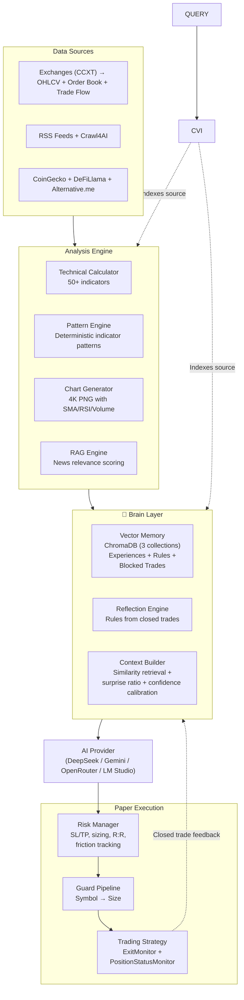

# 🤖 SEMANTIC SIGNAL LLM (LLM Trader)

*An autonomous AI trading agent that reads charts, remembers outcomes, sharpens its strategy in real time, and can search its own codebase using vector semantics.*

[](https://www.python.org)
[](LICENSE.md)
[](https://github.com/qrak/LLM_trader)

🌐 **[Public Landing Page](https://semanticsignal.qrak.org/landing.html)** — Interactive architecture overview & system showcase  
📊 **[Live Dashboard](https://semanticsignal.qrak.org)** — Watch the neural trading brain in action  
📖 **[Interactive Web Story & Tech](https://semanticsignal.qrak.org/story)** | **[GitHub Article Document](articles/architecture_and_journey.md)** — Read the 9-month development story  
💬 **[Join the Discord](https://discord.gg/ZC48aTTqR2)**  


---

> 💡 **Paper trading by default.** A real exchange execution service ([llm_trader_executor](https://github.com/qrak/llm_trader_executor)) is currently in testing — it consumes this bot's decisions and places live CCXT orders. Coming soon. Stay tuned.

---

## Quick Start

```bash
git clone https://github.com/qrak/LLM_trader.git && cd LLM_trader
python -m venv .venv && source .venv/bin/activate  # or .venv\Scripts\Activate.ps1 on Windows
pip install -r requirements.txt
cp keys.env.example keys.env  # optional; alternatively set your selected provider key in the OS environment
python start.py               # dashboard at http://localhost:8000
```

<details>
<summary>Detailed setup for Windows, Linux, macOS →</summary>

**Platform-specific scripts** live in `scripts/`:

| Script | Purpose |
|--------|---------|
| `scripts/start_script_main.ps1` | Start the bot (Windows) |
| `scripts/start_script_main_linux.sh` | Start the bot (Linux) |
| `scripts/start_script_main_macos.sh` | Start the bot (macOS) |
| `scripts/run_all_tests.sh` | Run full test suite in `.venv` |
| `scripts/query_trade_history.py` | CLI utility to inspect SQLite trade history |
</details>

### Runtime Controls

| Key | Action |
|-----|--------|
| `a` | Force analysis — run immediate market check |
| `d` | Toggle dashboard on/off |
| `h` | Help — show available commands |
| `q` | Quit — graceful shutdown with state preservation |

---

## System Requirements

| Component | Minimum | Recommended |
|-----------|---------|---------------------------|
| **Python** | 3.13+ | 3.14+ |
| **RAM** | 4 GB | 8+ GB |
| **Disk** | 2 GB | 5+ GB (logs + trade data) |
| **CPU** | 2 cores | 4+ cores (Ryzen 5700G+) |
| **GPU** | Not required | Not required |
| **OS** | Windows 10+, Linux, macOS | Linux (WSL2) |
| **Internet** | Required (API calls) | Required |

---

## Features

- **🧠 Brain with Memory** — ChromaDB vector store retains trade experiences, semantic rules, system rejections, and confidence statistics. Past outcomes are retrieved by similarity to current market conditions and injected into every LLM prompt.

- **📈 Vision AI Chart Analysis** — Generates 4K PNG candlestick charts with indicators, sends them to a multimodal LLM (DeepSeek V4.1 Flash) for visual pattern recognition. Chart-pattern code was dropped because the AI reads charts better than hardcoded rules.

- **🔄 Reflection Engine** — After every `N` closed trades, the system synthesizes best-practice rules, anti-patterns, and AI-mistake rules with **surprise ratio** annotation — high-surprise outcomes are flagged so the LLM discounts lucky/unlucky noise. Rules persist in vector memory and influence future decisions. The bot learns from its own outcomes.

- **🧠 VectorMemoryRulesMixin** — Semantic rule lifecycle management with decay scoring, evidence-weighted ranking, contradiction tracking, and surprise-ratio annotation. Rules are soft-ranked by similarity, evidence quality, timeframe freshness, and contradiction count — no hard pruning on age alone.

- **✅ Claim Validation** — Every LLM response is cross-checked against computed indicators. Reported trend strength is compared against actual ADX; pattern quality is replaced by a deterministic scorer. No blind trust in AI numeric claims.

- **📰 RAG News Engine** — Aggregates crypto news from free RSS feeds (CoinDesk, CoinTelegraph, Decrypt, CryptoSlate) with optional Crawl4AI enrichment, plus fundamentals from DeFiLlama and CoinGecko.

- **📊 Live Dashboard** — FastAPI + WebSocket real-time SPA at `0.0.0.0:8000` (or [semanticsignal.qrak.org](https://semanticsignal.qrak.org)). Nine tabs with brain activity, last prompt/response, position state, performance stats, news, market data, and memory bank.

- **🛡️ Risk Pipeline** — Pre-execution guard chain (symbol whitelist, max position size) + dynamic SL/TP scaling with minimum 1.5 R:R enforced. Soft exits at candle close, hard exits at configurable intervals against live ticker price.

- **🔄 Multi-Provider AI Routing** — Primary: DeepSeek V4.1 Flash (`deepseek-flash`, native chart vision). Fallback chain through Google Gemini / OpenRouter / LM Studio. Chart vision support on every provider that allows it.

- **🧪 1,380+ Tests** — Fully mocked test suite covering LLM output corruption, async races, rate-limit backoff, vector-DB boundaries, friction-reporting, closed-loop feedback, AST code indexing, and positional market types (spot / perpetual futures).

- **🗂️ Layered Agent Documentation** — Root [`AGENTS.md`](AGENTS.md) carries the system-wide rules and a map into per-package `AGENTS.md` files (`src/trading/`, `src/analyzer/`, `src/dashboard/`, `src/managers/`, `src/indicators/`, `src/rag/`, `src/trading/guards/`), so a coding model reads only the package it touches instead of the whole manual.

---

## Architecture


```mermaid
flowchart TB
    subgraph Data["Data Sources"]
        EX["Exchanges (CCXT) → OHLCV + Order Book + Trade Flow"]
        NEWS["RSS Feeds + Crawl4AI"]
        FUND["CoinGecko + DeFiLlama + Alternative.me"]
    end
    subgraph Analysis["Analysis Engine"]
        TC["Technical Calculator<br/>50+ indicators"]
        PE["Pattern Engine<br/>Deterministic indicator patterns"]
        CG["Chart Generator<br/>4K PNG with SMA/RSI/Volume"]
        RAG["RAG Engine<br/>News relevance scoring"]
    end
    subgraph Brain["🧠 Brain Layer"]
        VM["Vector Memory<br/>ChromaDB (3 collections)<br/>Experiences + Rules +<br/>Blocked Trades"]
        REFL["Reflection Engine<br/>Rules from closed trades"]
        CTX["Context Builder<br/>Similarity retrieval +<br/>surprise ratio + confidence calibration"]
    end
    subgraph Execution["Paper Execution"]
        RP["Risk Manager<br/>SL/TP, sizing, R:R,<br/>friction tracking"]
        GP["Guard Pipeline<br/>Symbol → Size"]
        STRAT["Trading Strategy<br/>ExitMonitor +<br/>PositionStatusMonitor"]
    end
    Data --> Analysis
    Analysis --> Brain
    Brain --> AI["AI Provider<br/>(DeepSeek / Gemini / OpenRouter / LM Studio)"]
    AI --> RP --> GP --> STRAT
    STRAT -.->|Closed trade feedback| Brain
    CVI -.->|Indexes source| Analysis
    CVI -.->|Indexes source| Brain
    QUERY --> CVI
```

### Key Files

| Path | Role |
|------|------|
| `start.py` | Entry point — 8-stage dependency injection, ChromaDB + CoinGecko cache + journal rotation |
| `src/app.py` | `CryptoTradingBot` — main async loop, ticker fetch, analysis orchestration |
| `src/trading/brain.py` | `TradingBrainService` — context assembly, experience recording, reflection triggers |
| `src/trading/vector_memory.py` | ChromaDB interface — trade experiences, semantic rules, blocked trades, embedding cache |
| `src/trading/vector_memory_rules.py` | `VectorMemoryRulesMixin` — semantic rule lifecycle: decay scoring, evidence ranking, surprise ratio |
| `src/analyzer/analysis_engine.py` | Market analysis orchestration — indicators, chart, RAG, LLM call |
| `src/managers/provider_orchestrator.py` | AI provider fallback chain with retry logic |
| `src/managers/risk_manager.py` | Dynamic SL/TP, position sizing, friction tracking |
| `src/managers/post_mortem_repository.py` | AI-written post-mortem after every closed trade |
| `src/trading/trading_strategy.py` | Position lifecycle, guard enforcement, exit monitoring |
| `src/analyzer/prompts/template_manager.py` | System prompt construction with falsification-based invalidation step |
| `src/analyzer/trend_validator.py` | Cross-checks LLM-reported trend strength against computed ADX |
| `src/analyzer/pattern_quality_scorer.py` | Deterministic pattern quality scoring replacing LLM's self-reported score |
| `src/notifiers/notifier.py` | Discord notifications with message expiration tracking |

---

## Testing

```bash
# Full suite (1,380+ tests)
pytest tests/ -q

# Focused
pytest tests/test_ticker_retry.py tests/test_brain_integration.py -q

# Linting
ruff check src tests start.py
```

| Test area | Count | Notes |
|-----------|-------|-------|
| Core trading | ~500 | Signals, orders, exits, risk, post-mortem |
| Vector memory | ~180 | ChromaDB operations, rules, scoring, embedding cache |
| Dashboard / brain router | ~120 | Decision pathways, admin endpoints, WS streaming |
| RAG / news / fundamentals | ~160 | RSS, Crawl4AI, news database, market data |
| Provider orchestration | ~100 | Fallback chain, retries, model pricing |
| Executor bridge | ~60 | Decision forwarding, dead letters, HTTP client |

---

## Configuration

Key settings in `config/config.ini`:

| Setting | Default | Description |
|---------|---------|-------------|
| `crypto_pair` | BTC/USDC | Trading pair |
| `timeframe` | 4h | Analysis candle timeframe |
| `provider` | googleai | AI provider (googleai, openrouter, deepseek, lmstudio) |
| `demo_quote_capital` | 10000 | Simulated capital |
| `max_position_size` | 0.10 | Max position as fraction of capital |
| `stop_loss_type` | hard | hard (interval check) or soft (candle close) |
| `stop_loss_interval_minutes` | 15 | Hard exit check interval |

Secrets can come from **OS / service environment variables (recommended)** or an optional
`keys.env` in the repository root. Process variables take precedence, including explicitly
empty values. Environment-only startup needs no `keys.env`. Both sources are read at startup;
restart after changes (on Windows, reopen the launcher terminal after changing persistent
variables). Environment variables are not encrypted: keep them out of logs and shell history.
See `keys.env.example` for the complete list and security notes.

Only the selected provider needs its key. OpenRouter-hosted Google or DeepSeek models use
**only `OPENROUTER_API_KEY`**, not the direct-vendor keys. With `provider = all`, unavailable
clients are skipped; supply credentials only for the fallbacks you want. `provider = local`
needs no cloud key. Unused entries may be empty or absent.

Provider / feature-specific credentials:

| Variable | Required | For |
|----------|----------|-----|
| `GOOGLE_STUDIO_API_KEY` | Only for `googleai` | Google AI Studio provider |
| `GOOGLE_STUDIO_PAID_API_KEY` | If used | Paid tier Google AI |
| `OPENROUTER_API_KEY` | Only for `openrouter` | All models served through OpenRouter |
| `DEEPSEEK_API_KEY` | Only for `deepseek` | DeepSeek official API provider |
| `BOT_TOKEN_DISCORD` | If used | Discord notifications |
| `MAIN_CHANNEL_ID` | If used | Discord notification channel |
| `COINGECKO_API_KEY` | No | Market metrics (rate limit boost) |
| `HF_TOKEN` | No | HuggingFace model access |

### Billing windows (`config/peak_rates.json`)

Some providers charge different rates at different hours — DeepSeek is half price off-peak
(Mon–Fri 01:00–04:00 and 06:00–10:00 UTC are peak; nights and the whole weekend are off-peak).
The bot applies that window when it reports a cost, so the log shows the price actually charged:
`Request cost: $0.007000 (off-peak x0.5)`.

- Per-token rates live in `config/model_pricing.json` and are treated as the BASE (peak) rates.
  `peak_rates.json` only declares **when** a window applies and how it scales those rates.
- The file is optional. Copy `config/peak_rates.example.json` to `config/peak_rates.json` and edit
  it; without the file the built-in defaults in `src/utils/peak_rates.py` apply, and anything not
  listed is billed flat. It is read at startup, so restart the bot after editing.
- Each provider entry is merged over its built-in default, so list only what you change. Example
  (shortening DeepSeek's peak window and turning the off-peak discount into a quarter price):

```json
{
  "deepseek": {
    "models": ["deepseek-flash", "deepseek-v4-flash-vision-exp", "deepseek-v4-pro"],
    "peak_multiplier": 1.0,
    "off_peak_multiplier": 0.25,
    "peak_windows_utc": [
      {"days": ["mon-fri"], "start_utc": "01:00", "end_utc": "04:00"}
    ]
  }
}
```

| Field | Meaning |
|-------|---------|
| `models` | Models the entry covers (omitted = every model of that provider) |
| `peak_multiplier` / `off_peak_multiplier` | Scale applied to the base rates inside / outside the peak windows |
| `peak_windows_utc` | Peak windows. `days` takes single names or inclusive ranges (`["mon-fri"]`, `["sat","sun"]`); clock values are UTC, start-inclusive and end-exclusive |
| `_default` | Entry used for providers and models nobody listed (multiplier `1.0` = flat rates) |

---

## Agent Documentation Map

Contributors (human or model) get the rules in layers, so nobody has to read the whole manual:

| File | Scope |
|------|-------|
| [`AGENTS.md`](AGENTS.md) | Authority, system overview, data flow, config, operational rules, code/security conventions, verification gates, map |
| [`src/AGENTS.md`](src/AGENTS.md) | Cross-package regression contracts (`parsing/`, `utils/`, `notifiers/`, `rag/`, `dashboard/`) |
| [`src/trading/AGENTS.md`](src/trading/AGENTS.md) | Trading brain, strategy, position management, monitors, notifiers |
| [`src/trading/guards/AGENTS.md`](src/trading/guards/AGENTS.md) | Pre-execution guard pipeline |
| [`src/analyzer/AGENTS.md`](src/analyzer/AGENTS.md) | Analysis engine, prompt templates, chart vision |
| [`src/indicators/AGENTS.md`](src/indicators/AGENTS.md) | Indicator computation and caching |
| [`src/managers/AGENTS.md`](src/managers/AGENTS.md) | Persistence, SQLite history, exchange adapters |
| [`src/rag/AGENTS.md`](src/rag/AGENTS.md) | Vector memory, crawl4ai news ingestion, market components |
| [`src/dashboard/AGENTS.md`](src/dashboard/AGENTS.md) | FastAPI dashboard, auth, UI and accessibility conventions |

Each file links back to the root; the root never duplicates package detail.

---

## Roadmap
 🔄 **Live Trading** — Real exchange order execution via [llm_trader_executor](https://github.com/qrak/llm_trader_executor) — currently in testing
- ⏳ **Multiple Trading Agent Personalities** — Conservative, aggressive, contrarian, trend-following strategists *(aspirational)*
- ⏳ **Multi-Model Consensus** — "Council of Models" architecture for collective decision-making *(aspirational)*

---

## Disclaimer

**NOT FINANCIAL ADVICE.** This software is experimental and in BETA. A real exchange execution service is in testing — use with caution. No warranty provided. Use at your own risk.

## License

[MIT](LICENSE.md)
